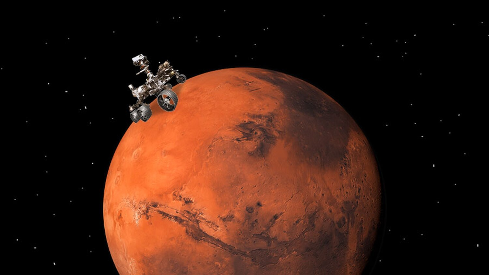

# Mission to Mars

## Table of contents
* [Assignment](#assignment)
* [Data Sources](#data_sources)
* [Website Design](#design)
* [Lesson Learned](#lessons)
* [References](#ref)

## Assignment
Perform web scraping and design an app to seamlessly display the scraped data into a user interactive website 
that can be updated by the push of a button.  

## Data Sources
Data was scraped from the following websites:  
- NASA Mars News from: https://mars.nasa.gov/news/
- Featured Mars Image from: https://www.jpl.nasa.gov/spaceimages/?search=&category=Mars
- Facts About Mars from: https://space-facts.com/mars/
- Mars Hemispheres from: https://astrogeology.usgs.gov/search/results?q=hemisphere+enhanced&k1=target&v1=Mars

To design the website, the following tools were used: 
- Web-scraping
- Flask app
- html coding with added custom styles (within the .html)
- Bootstrap css style sheet:  https://maxcdn.bootstrapcdn.com/bootstrap/3.3.7/css/bootstrap.min.css"

## Website Design
Data was scraped from each site using Spliter and Beautiful Soup, as shown in the jupyter notebook file, here: 
https://github.com/KLacerda08/web-scraping-challenge/tree/main/Missions_to_Mars.mission_to_mars.ipynb 

At first, a get request was attempt; however, while no errors were logged, data was not being returned.  
Therefore, Splinter was used. Splinter and Beautiful soup were used to scrape and parse the data, and to 
navigate to the various required pages. This required the use of click functions in Splinter to navigate to, and 
back from certain pages.  Additionally, Pandas was used to transform data from a scraped table to an html string 
that could be incorporated as a table back in website. The data was also saved to a separate html table for 
reference, here: https://github.com/KLacerda08/web-scraping-challenge/tree/main/Missions_to_Mars/table.html

The jupyter notebook file was saved as scrape_mars.py and transformed into functions that would interact with
the browser to scrape data from various urls.  The functions in scrape_mars.py were called in app.py, where 
the functions to create the interactive website are coded. The data was stored in a mongo database called 
"mars_app". 

The website was rendered using the html template, with supplemental custome styling, here: 
https://github.com/KLacerda08/web-scraping-challenge/tree/main/Missions_to_Mars/templates/index.html

To access the website, in your python environment, run app.py at the following link, and clicking on the 
Scrape New Data! button. https://github.com/KLacerda08/web-scraping-challenge/tree/main/Missions_to_Mars/app.py
 
Images of the site after running the app are shown below:

### Top of Website, Feature Image and Facts Table

### Mars Hemispheres

## Lessons Learned
This was a challenging project, but in the end it was also good practice for combining various things we 
have learned so far, html, css work, flask, and pandas, as well as new functions like web-scraping.  

## References
Readme image source: https://www.sfreporter.com/news/theinterface/2020/09/02/the-mars-chronicles/
